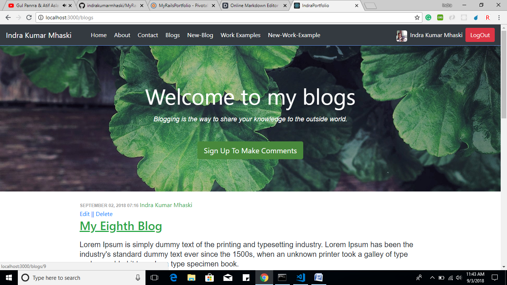

# Features :

-	As an author, I should be able to manage the content of my portfolio page.
-	As a visitor anyone should be able to watch my portfolio page.
-	As an author, I should be able to post and manage my work sample examples on site.
-	As a visitor, anyone should be able to watch and comment on my work sample examples on site.
-	As an author, I should be able to post and manage my blogs.
-	As a visitor, anyone should be able to watch and comment on my blogs.
-	There should be a contact page in the site so that any visitor can easily get information about how to contact me.
-	Before making a comment a user must be authenticated either via Devise or Google.
-	I should be able to manage my work example via drag and drop. 

### Summary:
> The main objective of this application is to serve as a 
> portfolio, it is totally a dynamic web application whose 
>content can be managed by its owner.

### Gems That Are Used:

```sh
gem 'devise', '~> 4.5'
gem 'carrierwave', '~> 1.2', '>= 1.2.3'
gem 'petergate', '~> 1.8', '>= 1.8.1'
gem 'bootstrap', '~> 4.1.3'
gem 'cocoon', '~> 1.2', '>= 1.2.11'
gem 'kaminari', '~> 1.1', '>= 1.1.1'
gem 'omniauth-google-oauth2'
gem 'jquery-ui-rails', '~> 6.0', '>= 6.0.1'
gem 'gritter', '~> 1.2'
```

### License:

MIT

---

### Home Page:


---

### Blogs:



---

### Drag And Drop Feature:

